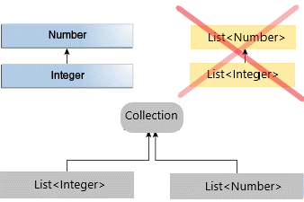
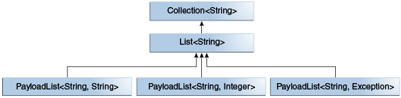

# Java Generics Types


### Bounded Type Parameters
Bounded type parameters are key to the implementation of generic algorithms.
There may be times when you'll want to restrict the kinds of types that are allowed 
to be passed to a type parameter. For example, a method that operates on numbers 
might only want to accept instances of Number or its subclasses. 
This is what bounded type parameters are for.
The following is how we read that _Bounded Type Parameter_:  
`<T extends Comparable<T>`: Type parameter `T` bounded by `Comparable<T>`.  

To declare a bounded type parameter, list the type parameter's name, followed by the extends keyword, followed by its upper bound.  
See [Example 3](GENERICS-EXAMPLES.md#example-3---generic-method-bounded-type-parametere3genericmethodboundedtypeparametersjava-)


### Generics, Inheritance, and Subtypes
As you already know, it is possible to assign an object of one type to an object of another type provided that the types are compatible.
```java
Object someObject = new Integer(10); //OK
Number number = new Integer(10); // OK
```
this is called an "is a" relationship. 
Since an <code>Integer</code> is a kind of <code>Object</code> and also is a kind of <code>Number</code>, 
the assignments of above are allowed.  
However the following code doesn't accepted.
```java
List<Number> numberList = new ArrayList<Integer>();
``` 
Because <code>List\<Integer></code> is not a subtype of <code>List\<Number></code>.  


See [the example](E5GenericAndSubtyping.java).  

#### Generic Classes and Subtyping
You can subtype a generic class or interface by extending or implementing it.
The relationship between the type parameters of one class or interface and the type parameters of another are determined 
by the `extends` and `implements` clauses.  
Using the `Collections` classes as an example, `ArrayList<E>` implements `List<E>`, and `List<E>` extends `Collection<E>`. 
So `ArrayList<String>` is a subtype of `List<String>`, which is a subtype of `Collection<String>`. 
So long as you do not vary the type argument, the subtyping relationship is preserved between the types.  

  

Now imagine we want to define our own list interface, `PayloadList`, that associates an optional 
value of generic type `P` with each element. Its declaration might look like:
```java
interface PayloadList<E,P> extends List<E> {
  void setPayload(int index, P val);
  ...
}
```
The following parameterizations of `PayloadList` are subtypes of `List<String>`:
* `PayloadList<String,String>`
* `PayloadList<String,Integer>`
* `PayloadList<String,Exception>`  

  
  
See [the example](GENERICS-EXAMPLES.md#example-5---generic-and-subtypinge5genericandsubtypingjava).
#### Wildcard and Subtyping 

Wildcard means the _Type of unknown_ and defined with `?`.  
The wildcard `?` in Java is a special type parameter that controls the type safety 
of the use of generic (parameterized) types. It can be used in **variable declarations and instantiations** 
as well as in **method definitions**, 
For example, `Collection<?>` pronounced _collection of unknown_.
If you defined it without the `extend` or `super` this is interpreted `Collection<? extends Object>` by Java.  
It means you could put any subtypes of `Object` Type for this collection without subtyping issue.  
You could resolve the issue of Subtyping the above List  

   
by using 
[Wildcard]() .  

In generic code, the question mark (`?`), called the wildcard, represents an unknown type.
The wildcard can be used in a variety of situations: as the type of a parameter, field, or local variable; 
sometimes as a return type (though it is better programming practice to be more specific). 
The wildcard is never used as a type argument for a generic method invocation, 
a generic class instance creation, or a supertype.  

##### Wildcard as a Parameter Type
In the body of a generic unit, the (formal) type parameter is handled like its _upper bound_ (expressed with `extends`; `Object` if not constrained). 
If the return type of a method is the type parameter, the result (e.g. of type `?`) can be referenced by 
a variable of the type of the upper bound (or Object). In the other direction, the wildcard fits no other type, 
not even `Object`: If `?` has been applied as the formal type parameter of a method, no actual parameters can be passed to it. 
However, objects of the unknown type can be read from the generic object and assigned to a variable of a supertype of the _upperbound_.  
[See the example.](E7GenericWildcard.java)

In order to access `Number`'s method through `list<Integer>`'s elements use upper-bounded Wildcard:
```java
List<? extends Integer> intList = new ArrayList<>();
List<? extends Number>  numList = intList;  // OK. List<? extends Integer> is a subtype of List<? extends Number>
```
Because `Integer` is a subtype of `Number`, and `numList` is a list of `Number` objects, 
a relationship now exists between `intList` (a list of `Integer` objects) and `numList`. 
The following diagram shows the relationships between several `List` classes declared with both upper and lower bounded wildcards.  


#### Generic Wildcard
To find out Generic Wildcard [see this](GENERICS-WILDCARD-Bounded)
  