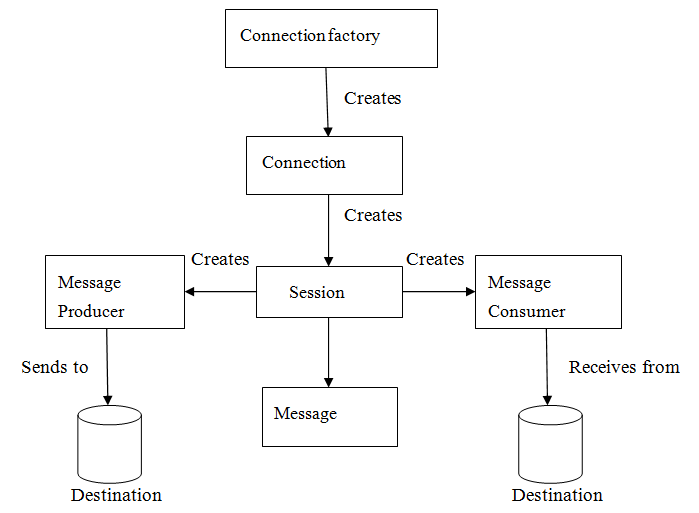

# Java Message Service (JMS) API

**JMS** is a technique which is used in J2EE technology for an application 
to communicate with the other application in loosely coupled manner 
sending messages to each others. It means that the applications which have to communicate 
are not connected directly they are connected through a common destination.
JMS is not a part of J2SE JDK and must be added from its implementations like ActiveMQ.

#### JMS implementations
The following is a list of common JMS providers:

* Amazon SQS's Java Messaging Library
* Apache ActiveMQ
* Apache Qpid, using AMQP[17]
* IBM MQ (formerly MQSeries, then WebSphere MQ)
* IBM WebSphere Application Server's Service Integration Bus (SIBus)[18]
* JBoss Messaging and HornetQ from JBoss
* JORAM from the OW2 Consortium
* Open Message Queue from Oracle
* OpenJMS from the OpenJMS Group
* Oracle WebLogic Server and Oracle AQ
* RabbitMQ from Pivotal Software


#### Need of JMS
In Java, if a person wants to send a message from one application to another in such 
a way that both application do not know anything about each other, 
even they may be deployed in separate continents with no dependency at all.  

For example, one application A is running in India and another application 
is running in USA, and B is interested in getting some updates/messages 
from A – whenever something unique happen on A. There may be N number of 
such applications who are interested in such updates from A.  

In this type JMS Server publishes the message and forget it, 
whenever client comes online, it will fetch the message.

#### Benefits of JMS

* **Asynchronous**:
JMS is asynchronous by default. So to receive a message, the client is not required 
to send the request. The message will arrive automatically to the client as they become available.

* **Reliable**:
JMS provides the facility of assurance that the message will delivered once 
and only once. You know that duplicate messages create problems. 
JMS helps you avoiding such problems.

#### JMS Messaging Domains

Before the JMS API existed, most messaging products supported either 
the **point-to-point** or the **publish/subscribe** approach to messaging. 
The _JMS_ provides a separate domain for each approach and defines the 
compliance for each domain. Any _JMS_ provider can implement both or one domain, 
it’s his own choice. The JMS provides the common interfaces which enables us 
to use the JMS API in such a way that it is not specific to the either domain.

##### Point-to-Point Messaging Domain
##### Publish/Subscribe Messaging Domain


#### JMS participating objects
JMS application has some basic building blocks, which are:  
* Administered objects – Connection Factories and Destination
* Connections
* Sessions
* Message Producers
* Message Consumers
* Message Listeners

  

##### JMS Administered Objects
JMS application provides two types of administered objects:  
* Connection Factories
* Destinations

These two administered objects are created by JMS system administrator in 
JMS Provider by using the Application Server the admin console. 
These both objects are stored in Application server JNDI Directory or JNDI Registry.

##### Connection Factories
The client uses an object which is a **connection factory** used to create a 
connection to a provider. It creates connection between JMS Provider and JMS Client. 
When JMS Client such as sender or receiver search out for this object 
in JNDI Registry, then the JMS Client receives one connection object 
which is nothing just a physical connection between JMS Provider and JMS Client. 
Using this connection, client can have communication with the destination 
object to send or receive messages into Queue or Topic. Example:
```java
QueueConnectionFactory queueConnFactory = (QueueConnectionFactory) initialCtx.lookup ("primaryQCF");
Queue purchaseQueue = (Queue) initialCtx.lookup ("Purchase_Queue");
Queue returnQueue = (Queue) initialCtx.lookup ("Return_Queue");
```